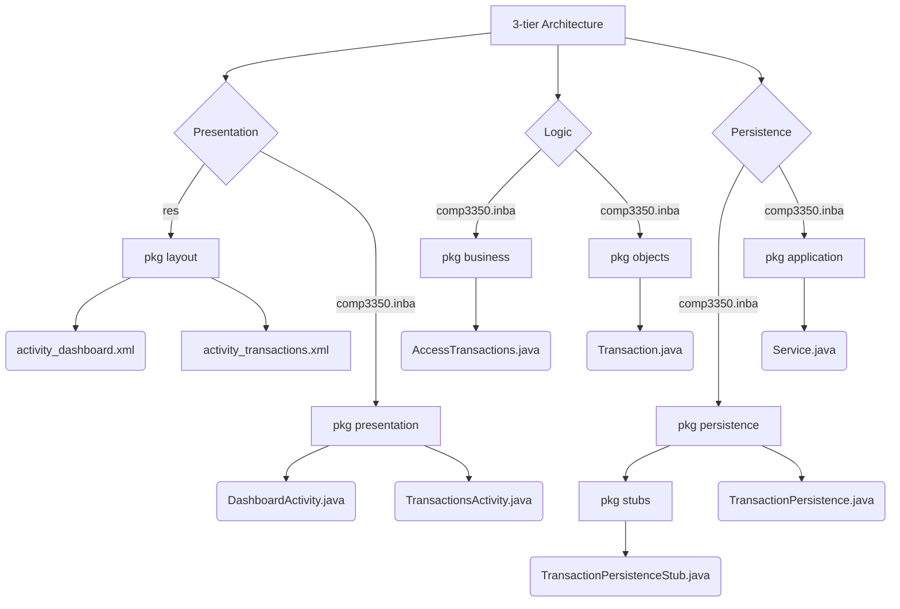

```mermaid
graph TD
    A[3-tier Architecture]
    A --> PR{Presentation}
    A --> L{Logic}
    A --> PE{Persistence}

    PR --> |res| R[pkg layout]
    R --> ACTD(activity_dashboard.xml)
    R --> ACTT[activity_transactions.xml]
    PR ----> |comp3350.inba| PRES[pkg presentation]
    PRES --> DACT(DashboardActivity.java)
    PRES --> TACT(TransactionsActivity.java)

    L --> |comp3350.inba| BUS[pkg business]
    BUS --> AT(AccessTransactions.java)
    L --> |comp3350.inba| OBJ[pkg objects]
    OBJ --> TRANS(Transaction.java)

    PE ----> |comp3350.inba| PER[pkg persistence]
    PER --> STUB[pkg stubs]
    STUB --> TPS(TransactionPersistenceStub.java)
    PER --> TP(TransactionPersistence.java)
    PE --> |comp3350.inba| APP[pkg application]
    APP --> SERV(Service.java)
```
